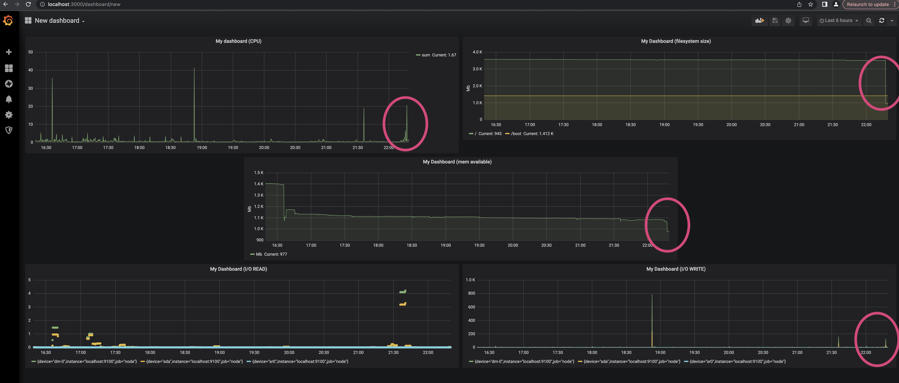

## Part 7. **Prometheus** и **Grafana**

Практика с логами пока что окончена. Теперь пришло время мониторить состояние системы в целом.

**== Задание ==**

1. Установи и настрой **Prometheus** и **Grafana** на виртуальную машину.
  - Устанавливаем **Prometheus** `sudo apt instal prometheus`
  - Устанавливаем **Grafana** `sudo snap install grafana`
  - Проверка работы **Prometheus** (`systemctl status prometheus`):
  

2. Получи доступ к веб-интерфейсам **Prometheus** и **Grafana** с локальной машины.
  - Проброс портов до виртуальной машины:
  
    - `3000` - до Grafana
    - `9090` - до Prometheus
  - Интерфейс Prometheus с локальной машины:
  
  - Интерфейс Grafana с локальной машины:
  

3. Добавь на дашборд **Grafana** отображение ЦПУ, доступной оперативной памяти, свободное место и кол-во операций ввода/вывода на жестком диске.
  - Добавляем новый источник данных: `Configuration -> Data Sources -> Prometheus`
  
  - В **URL** вводим адрес `http://localhost:9090`:
  
  - Создаем новый дашборд (`New Dashboard -> Add Query`) и добавляем:
    - `sum(rate(node_cpu_seconds_total{mode!="idle"}[30s])) * 100` - отображение загрузки процессора (CPU), все режимы, кроме простоя системы
    
    
    - `node_filesystem_avail_bytes{fstype=~"ext4|xfs"} / 1024 / 1024` - свободные Mb в файловой системе
    
    
    - `node_memory_MemAvailable_bytes/1024/1024` - свободной оперативной памяти в Mb
    
    
    - `rate(node_disk_reads_completed_total[5m])` - I/O READ
    - `irate(node_disk_writes_completed_total[5m])`- I/O WRITE
    
    
    

4. Запусти свой bash-скрипт из [Части 2](#part-2-засорение-файловой-системы). Посмотри на нагрузку жесткого диска (место на диске и операции чтения/записи).
  - До запуска скрипта 02:
  
  - После запуска скрипта 02 (рост использования CPU и записей на диск, падение доступной оперативной памяти и свободной памяти на диске - все выделено на скриншоте):
  

5. Установи утилиту **stress** и запусти команду `stress -c 2 -i 1 -m 1 --vm-bytes 32M -t 10s`. Посмотри на нагрузку жесткого диска, оперативной памяти и ЦПУ.
  - До запуска утилиты `stress` (масштаб для наглядности уменьшен до 1 часа):
  
  - Запуск утилиты `stress`:
  
  - После запуска утилиты `stress`:
  
