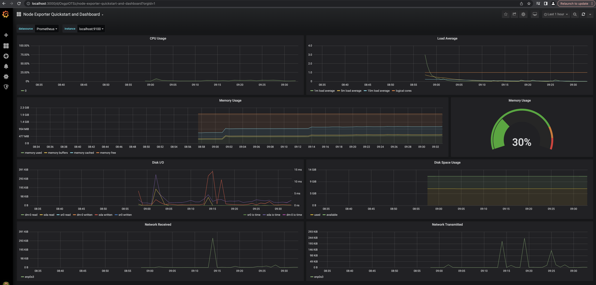
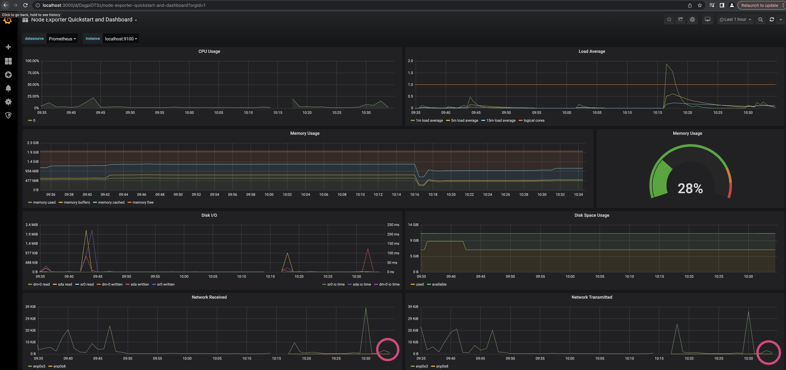

## Part 8. Готовый дашборд

Собственно, зачем составлять собственный дашборд, если, как говорится, «всё уже украдено до нас»?
Почему бы не взять готовый дашборд, на котором есть все нужные метрики?

**== Задание ==**

1. Установить готовый дашборд *Node Exporter Quickstart and Dashboard* с официального сайта **Grafana Labs**
    - На сайте Grafana Labs (https://grafana.com/) находим дашборд *Node Exporter Quickstart and Dashboard*. Ссылка: https://grafana.com/grafana/dashboards/14059-node-exporter-quickstart-and-dashboard/
    
    - В Grafana на локальной машине переходим в `Create -> Import` и вставляем ссылку готовоо дашборда в первое поле ввода. Нажимаем на появившуюся кнопку `Import`:
    
    - Готовый дашборт в Grafana на локальной машине:
    

2. Провести те же тесты, что и в [Части 7](#part-7-prometheus-и-grafana)
    - До запуска bash-скрипта 02:
    
    - Запускаем скрипт:
    
    - Скрипт выполнен:
    
    - После выполнения скрипта (всплески выделены):
    
    - Запуск утилиты stress командой `stress -c 2 -i 1 -m 1 --vm-bytes 32M -t 10s`:
    
    - После запуска утилиты stress (всплески выделены):
    

3. Запустить ещё одну виртуальную машину (VM2, 192.168.100.10/16), находящуюся в одной сети с текущей.
    - Новая виртуальная машина с дополнитеольным интерфейсом `enp0s8`:
    
    - К основной (VM1, 172.24.116.8/12) виртуальной машине добавляем интерфейс `enp0s8` и настраиваем его:
    
    
    - VM2 также настраиваем:
    
    
    
    - Ping VM2->VM1 пока не проходит. Нужно добавить статический маршрут между машинами:
    
    
    
    - Ping VM2->VM1 наконец проходит после применения настроек на VM1:
    
4. Запустить тест нагрузки сети с помощью утилиты **iperf3**. Посмотреть на нагрузку сетевого интерфейса.
    - Устанавливаем `iperf3` на обе виртуальные машины (`sudo apt install iperf3`). Сначала запускаем проверку по схеме:
        - VM1 - сервер
        - VM2 - клиент
    
    
    - Данные переданы и получены успешно:
    
    
    - Всплесков `enp0s8` нет:
    
    - Запускаем проверку по схеме:
        - VM1 - клиент
        - VM2 - сервер
    
    - Изменение передано/получено в Grafana:
    
