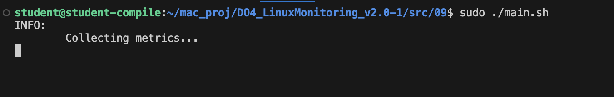

## Part 9. Дополнительно. Свой *node_exporter*

Анализировать систему с помощью специальных утилит полезно и удобно, но Джону всегда хотелось понять, как же они работают.

**== Задание ==**

1. Написать bash-скрипт или программу на С, которая собирает информацию по базовым метрикам системы (ЦПУ, оперативная память, жесткий диск (объем)). Скрипт или программа должна формировать html страничку по формату **Prometheus**, которую будет отдавать **nginx**. \
Саму страничку обновлять можно как внутри bash-скрипта или программы (в цикле), так и при помощи утилиты cron, но не чаще, чем раз в 3 секунды.
    - Выполнение скрипта `main.sh`:
    

2. Поменять конфигурационный файл **Prometheus**, чтобы он собирал информацию с созданной вами странички.
    - В Prometheus дабвлена новая `job` - adinamar, которая собирает метрики с `localhost:9101` (файл конфигурации prometheus.yml в текущей директории)
     \
     \
    Для этого нужно настроить nginx.
    - Устанавливаем `nginx` на виртуальной машине (`sudo apt install nginx`)
    - Создаем папку `mkdir -p /var/www/mymetrics/html`, в которой будет страница с метриками
    - Создаем страницу `metrics` - в нее будут складываться наши метрики
    - Редактируем файл конфигурации nginx в директории `sudo nano /etc/nginx/nginx.conf` (файл конфигурации nginx.conf в текущей директории)
     
        - nginx слушает 9101 порт (чтобы с локальной машины получить метрики, пробрасываем 9101 на 9101 порт в VBox)
        
        - при переходе на `/metrics` nginx отдает файл `metrics` на обратно, в который каждые 3 секунды записываются собираемые метрики
    - Проверяем конфигурационный файл `nginx.conf` на наличие ошибок командой `sudo nginx -t`
    
    - Перезапускаем nginx-сервер командой `sudo nginx -s reload`
    - Изменяем конфигурацию Prometheus (`sudo nano /etc/prometheus/prometheus.yml`, файл новой конфигурации в текущем каталоге)
    - Перезапускаем службу Prometheus (systemctl restart prometheus)
    - Новый файл конфигурации успешно применен
    
    - В Prometheus по адресу `http://localhost:9090/targets` можно заметить, что метрики собираются с 9101 порта localhost

3. Провести те же тесты, что и в Части 7
    - Запускаем скрипт 09:
    
    - Собственные метрики с 9101 порта имеют приставку `my_`:
    
    - Добавили на экран все три метрики. Состояние до запуска:
    
    - Запускаем скрипт 02, отправив сборщик метрик в фон сочетанием CTRL+Z и командой bg:
    
    - После запуска:
    
    - До запуска утилиты `stress`:
    
    - Запускаем командой `stress -c 2 -i 1 -m 1 --vm-bytes 32M -t 10s`:
    
    - После запуска скрипта 02:
    
